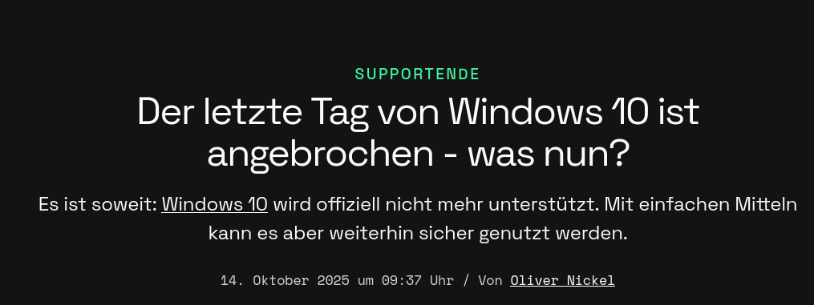
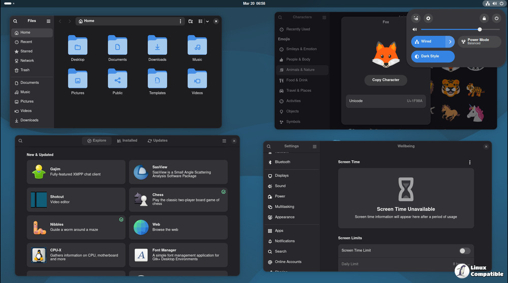
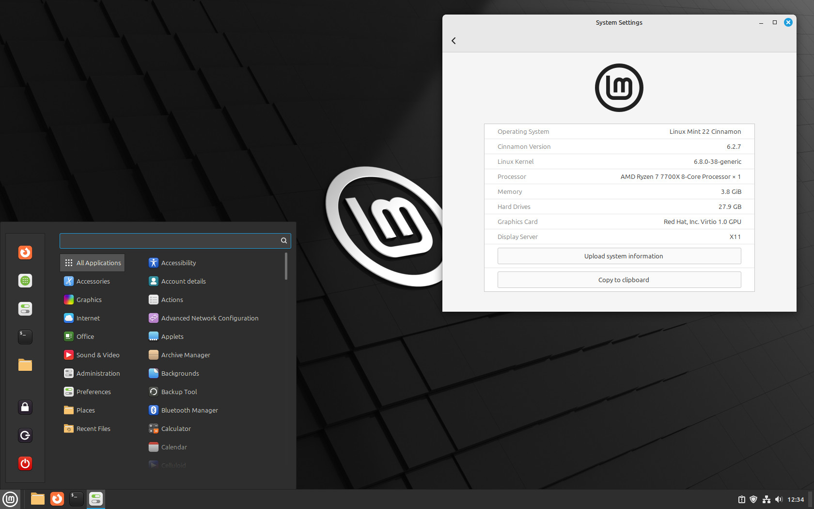
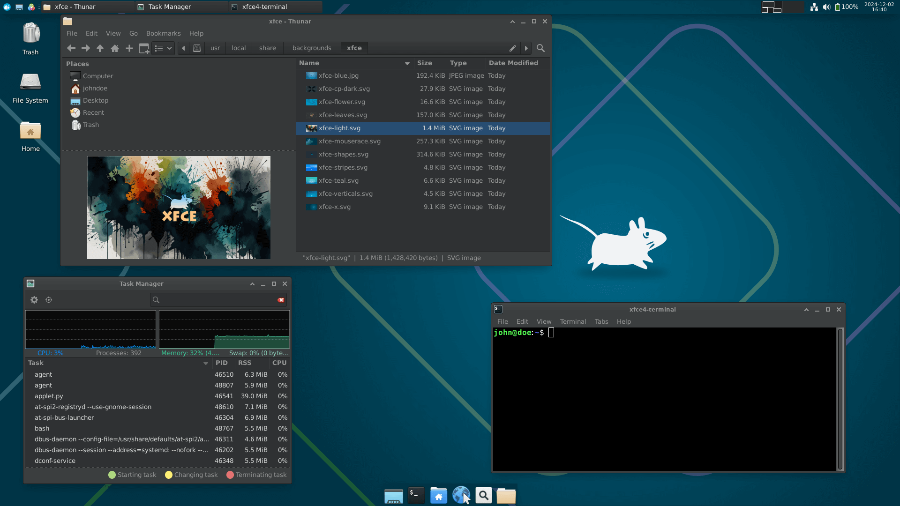

##
<figure>
  
  <figcaption>Supportende^[https://www.golem.de/news/supportende-der-letzte-tag-von-windows-10-ist-angebrochen-was-nun-2510-201126.html]</figcaption>
</figure>

## Erfindergeist

Intro

## Windows 10

* Das Supportende war am 14. Oktober 2025!
* Bekannte Sicherheitslücken werden nicht mehr geschlossen, folglich erhebliche Sicherheitsprobleme für Nutzer:innen
* [Extended security updates](https://www.microsoft.com/en-us/windows/extended-security-updatesj)
  - Sicherheitsupdates bis zum 13. Oktober 2026
  - Nicht kostenlos! Entweder $30 USB oder 1000 Microsoft Punkte oder Upload von Daten

**Fazit:** Ein Wechsel sollte in jeden Fall unbedingt erfolgen! Entweder auf Windows 11 oder Linux

## Windows 11

* Windows 11 setzt neue Hardware voraus (TPM 2.0 und Secure Boot)[^1]
* Rechner die diese Voraussetzungen nicht erfüllen werden somit quasi zu Elektroschrott
* In Windows 11 muss jeder lokale Nutzeraccount mit einem Microsoft Cloud Account verknüpft werden[^2]

[^1]: [Windows 11 Systemanforderungen](https://support.microsoft.com/de-de/windows/systemanforderungen-f%C3%BCr-windows-11-86c11283-ea52-4782-9efd-7674389a7ba3)
[^2]: [https://www.fsf.org/windows](https://www.fsf.org/windows)

## Linux

* Sehr verbreitet und viele nutzen es eigentlich schon täglich (WLAN-Router, Smart TV, Smartphone, Internetserver, Auto)
* Läuft performant auch auf älterer Hardware
* Privatsphäre geschützt - kein Zwang zu einer Cloud-Anbindung
* Einfach bedienbar
* Sicher, quelloffen, kostenlos

## Distributionen
* Linux bezeichnet den innersten Kern, das komplette System nennt sich Distribution
* Besteht aus Kernel, Treibern, Programmen und einer grafischen Oberfläche
* Es gibt hunderte Distributionen in verschiedenen "Geschmacksrichtungen"
* Linux Mint, Ubuntu, Suse, Fedora, etc.
* [https://distrochooser.de/de](https://distrochooser.de/de)

## Grafische Oberflächen - Gnome
<figure>
  
  <figcaption>Quelle^[https://www.linuxcompatible.org/story/gnome-49alpha-released/]</figcaption>
</figure>

## Grafische Oberflächen - Gnome
* Erinnert an MacOS, aber moderner und flotter
* Eher minimalistisch, Menüleisten werden auf das nötigste beschränkt
* Statt eines Startmenüs gibt es eine Progammübersicht über "Super" (Windows- bzw. Apfel-Taste)
* Der Computer sollte nicht älter als 10 Jahre sein

## Grafische Oberflächen - KDE Plasma
<figure>
  
  <figcaption>Quelle^[https://kde.org/announcements/plasma/6/6.5.0/]</figcaption>
</figure>

## Grafische Oberflächen - KDE Plasma
* Umfangreich, sehr anpassbar und modern
* Erinnert optisch an Windows
* Kann überfordernd wirken durch viele Optionen, Funktionen und Einstellungen
* Der Computer sollte nicht älter als 10 Jahre sein

## Grafische Oberflächen - Cinnamon
<figure>
  
  <figcaption>Quelle^[https://linuxiac.com/linux-mint-22-wilma/]</figcaption>
</figure>

## Grafische Oberflächen - Cinnamon
* Schlicht und ressourcenschonend (Linux Mint)
* Läuft auch auf älteren Systemen flüssig
* Windows-Umsteiger finden sich schnell zurecht

## Grafische Oberflächen - XFCE
<figure>
  
  <figcaption>Quelle^[https://ostechnix.com/xfce-4-20-released-with-experimental-wayland-support/]</figcaption>
</figure>

## Grafische Oberflächen - XFCE
* Besonders flüssig auf älteren Systemen
* Schlicht und funktionell
* Ähnlichkeit mit Windows durch die Startleiste, das Startmenü und den Schnellstart Symbolen

## Grafische Oberflächen
...und viele mehr

## Applikationen - Unproblematisch
* **Office:** Libreoffice - Freie Formate nutzen (.odt vs. .docx)
* **E-Mail**: Thunderbird
* **Browser**: Firefox/Chrome
* **PDF**: Firefox, Evince
* **Spiele:** Steam, Heroic
* **Immer an Board:** Fotoanzeigen, Musik, Videos, Dateimanager, Drucker, Scanner

## Applikationen - Unproblematisch
* **Sonstige:** OBS (Streaming), Audacity (Audio-Editor), Darktable (Foto-Editor), Mumble (Audio-Chat), Signal (Messaging)
* **Software Installation:** Gnome Software Center, Mint Software store

## Applikationen - Potentiell problematisch

* Microsoft office -> Im Browser
* Adobe (Photoshop etc.) -> benutzerfreundliche Alternativen: gimp, inkscape
* Steuersoftware -> Alternative: online
* Konfigurationssoftware für spezielle Geräte (z.B. Fitnesstracker, etc.)

## Voraussetzungen
- SSD, kein 32bit 64bit , RAM

## Vorbereitung der Installation
* Backup vorhandener Daten!
* Speziell Passwörter, z.B. falls im Browser gespeichert
* Download der ausgewählten Distribution
* USB Stick erstellen -> Rufus (windows) oder Balena etcher (Mac, windows, Linux?)
* Bitlocker?
* Tastenkombination zum BIOS herausfinden: Suchmaschine deiner Wahl nach „BIOS [ exaktes Rechner- /Mainboard-Modell ] key combination“ (Üblich F2, F12, Delete, Esc, Enter)
* Startup -> Boot -> USB Stick auswählen
* Save and Exit (F10)
* Ausprobieren des live Modus
* Testen der Hardware

## Ablauf der Installation
Übliche Schritte

* Sprache
* Internetverbindung einrichten (WLAN oder Kabel) um gleich updates zu installieren, kann aber auch nach der Installation passieren
* Multimedia Codecs installieren um später alle Video- und Audio-Formate abspielen zu können
* Formatierung: Festplatte löschen -> Achtung hierbei werden alle Daten gelöscht
* Optional: Verschlüsselung aktivieren
* Zeitzone: deutsche Zeit/Datum ist "Europe/Berlin"
* Tastaturlayout
* Nutzeraccount und sicheres Passwort

Demo?

## Pflege nach der Installtion
Regelmäßige Updates -> hängt von der Distribution ab

## Nicht behandelt
- virtualisierung, emulation, winboat, winapps, etc.
- dual boot
- eigene Festplatte für Linux
* Grafiktreiber

## Quellen & weiterführende Links
* [LWN - Providing support for Windows 10 refugees](https://lwn.net/Articles/1037132/)
* [netzpolitik.org - Von Windows 10 auf Linux](https://netzpolitik.org/2025/von-windows-10-auf-linux-was-tun-wenn-der-computer-nicht-fuer-windows-11-geeignet-ist/)
* [c't uplink podcast - Windows 10 in eine Linux VM umziehen](https://ct-uplink.podigee.io/620-windows-10-in-eine-linux-vm-umziehen-c-t-uplink)
* [microsoft.com - Windows 10 support has ended](https://support.microsoft.com/en-us/windows/windows-10-support-has-ended-on-october-14-2025-2ca8b313-1946-43d3-b55c-2b95b107f281)
* [digselver.de - Webinar](https://digselver.de/wiki/books/termine-end-of-10-und-dokumentation/page/webinar-12062025-umrusten-und-installieren-einer-linux-distribution)
* [reparatur-initiativen.de - Linux anstiftung](https://www.reparatur-initiativen.de/files/kcfinder/posts/97597/2025-03-24-KDE-linux-anstiftung.pdf)
* [Ubuntu discourse - Ubuntu and bitlocker](https://discourse.ubuntu.com/t/ubuntu-installation-on-computers-running-windows-and-bitlocker-turned-on/15338)
* [krebsonsecurity - End of 10](https://krebsonsecurity.com/2025/10/patch-tuesday-october-2025-end-of-10-edition/)
* [pirg.org - Why the end of support for Windows 10 is troubling](https://pirg.org/articles/why-the-end-of-support-for-windows-10-is-uniquely-troubling/)

## Feedback & Spenden
Umfrage
Spende
